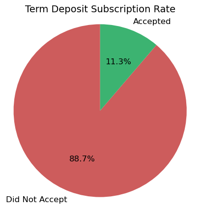
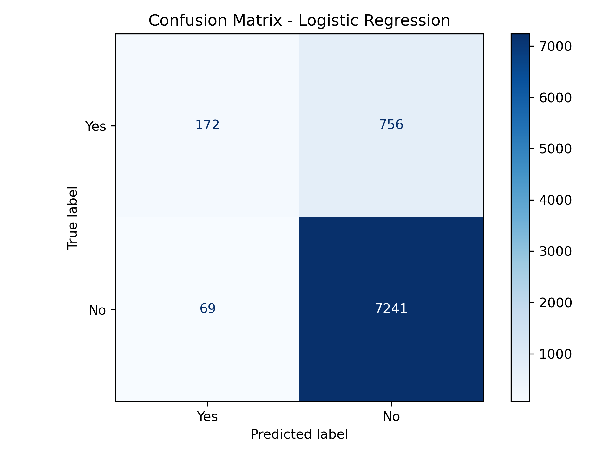
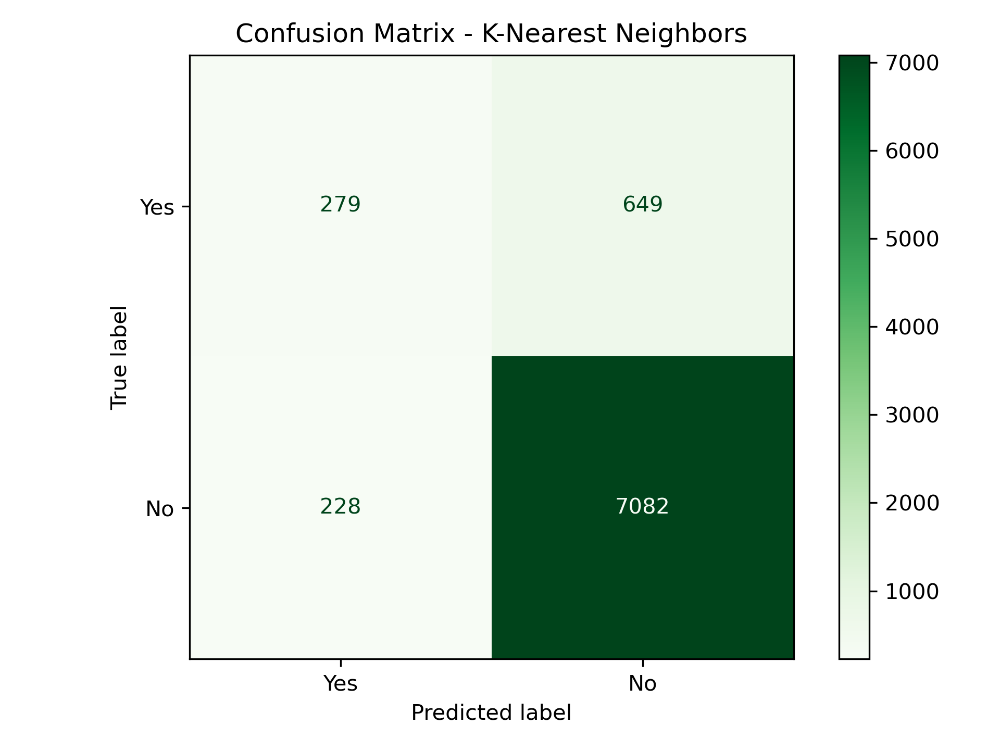

# UCB_AI-ML_17.1_Bank_Term_Deposit_Classification

This repository contains:
- **prompt_III_DF.ipynb**: Jupyter Notebook containing exploratory data analysis, feature engineering, model comparison, and tuning.
- **data/**: Folder containing the dataset used in this project. 
- **images/**: Folder with generated plots and visualizations.
- **CRISP-DM-BANK.pdf**: PDF file of research paper "Using Data Mining for Bank Direct Marketing: An Application of the CRISP-DM Methodology"

---

## 📌 Project Description

This project explores a binary classification problem using a bank marketing dataset. The task is to predict whether a client will subscribe to a term deposit (`y = 'yes'`) based on demographic, campaign, and economic features. I evaluated multiple classifiers and focused on optimizing recall and ROC AUC for the minority class.

---

## ❓ Problem

Only about **12% of clients** subscribe to a term deposit, making this an imbalanced classification problem. While a model predicting "no" for every case would score ~88% accuracy, it would fail completely at identifying the successful outcomes that are actually important.

Instead of optimizing for accuracy, I focused on:
- **Recall** (to maximize captured "yes" cases)
- **ROC AUC** (to assess overall ranking quality and potentially be used for prioritization reach out)

A meaningful model should achieve **recall > 0.30** and **ROC AUC > 0.70** to outperform random guessing.
After some initial exploratory data analysis (EDA), I made the following hypotheses to guide my analysis.  My hope was to identify areas of opportunity to increase the program's success (as measured by term deposit offer acceptance) through my understanding of what factors were correlated to a customer's increased probability of accepting an offered term deposit.

---

## 🔍 Hypotheses

#### **Primary Hypothesis**

Customer acceptance rates for term deposit offers are influenced by **macroeconomic conditions**. Since term deposits require locking away funds for a fixed period, customers are likely to make these decisions when they **feel financially secure** and the **economic environment favors saving**.

Specifically:
- When **employment is rising** (`emp.var.rate`), customers may feel more secure in their income and more open to long-term savings.
- When **interest rates are favorable** (e.g., lower `euribor3m`) and **inflation is stable or declining** (`cons.price.idx`), term deposits become more attractive relative to other options.
- Given that macroeconomic indicators are released quarterly, customer sentiment — and thus campaign performance — may exhibit **quarterly patterns** driven by these releases.

#### **Secondary Hypothesis**

Customer **demographics** (such as age, job type, and education level) will have a **moderate influence** on term deposit acceptance rates. Certain segments — like those in professional roles, those with higher education, or older clients nearing retirement — may be more inclined toward conservative, long-term savings products.

---

## 📊 Exploratory Data Analysis (EDA)

During EDA, I explored relationships between features and the likelihood of term deposit acceptance rate.

Key insights:
- Acceptance rate increases steadily with age, with a notable jump at 60+.
- Clients with university degrees had slightly higher subscription rates than others.
- Previous campaign success and prior contact were highly correlated with positive outcomes.

Plots are available in the `images/` directory and embedded in the notebook.

---

## 🧠 Models Compared

I implemented and compared four classifiers:
- Logistic Regression
- K-Nearest Neighbors (KNN)
- Decision Tree
- Support Vector Machine (SVM)
  
---

## 🔬 Evaluation Metrics

Each model was evaluated both before and after feature updates and hyperparameter tuning:
- **Recall** on the positive class (`y_binary == True`) — to measure how well the model identifies **actual subscribers**.
- **ROC AUC** — to measure how well the model can **rank clients by their likelihood of subscribing**, which is especially useful for **prioritizing outreach**.
- **Training time** — to measure **scalability and efficiency**, especially important for resource-heavy models like SVM.

---
# Findings:
---

## 📈 Model Performance Summary

#### Baseline vs. Feature Engineering Updates vs. with Hyperparameter Tuning

| Model                    | Train Time Baseline | Train Time Features | Train Time w/Tuning | Recall (yes) Baseline | Recall (yes) Features | Recall (yes) w/Tuning | ROC AUC Baseline | ROC AUC Features | ROC AUC w/Tuning |
|--------------------------|------------------------|------------------------|----------------------------|------------------------|------------------------|-----------------------------|-------------------|------------------|------------------------|
| **Logistic Regression**  | 0.0979 s               | 0.0692 s               | 0.7601 s                   | 0.1789                 | 0.1843                 | 0.1853                      | 0.7770            | 0.7777           | 0.7778                 |
| **K–Nearest Neighbors**  | 0.0256 s               | 0.0125 s               | 3.8303 s                   | 0.2769                 | 0.3082                 | 0.3006                      | 0.7193            | 0.7485           | 0.7137                 |
| **Decision Tree**        | 0.0973 s               | 0.0296 s               | 1.0707 s                   | 0.3265                 | 0.2554                 | 0.2597                      | 0.6204            | 0.6457           | 0.7338                 |
| **Support Vector Machine** | 63.3919 s            | 22.2335 s              | 268.667 s                  | 0.2037                 | 0.2144                 | 0.2155                      | 0.6788            | 0.6786           | 0.7085                 |

#### Summary

- Feature engineering significantly reduced training time and often improved both recall and ROC AUC.
- Tuning hyperparameters boosted ROC AUC for all models, especially the Decision Tree (from 0.6457 to 0.7338).
- K-Nearest Neighbors maintained the highest recall across all phases, although its AUC decreased slightly with tuning.
- Logistic Regression remained the most consistent and interpretable model, with top AUC and stable recall.
- Support Vector Machine showed modest performance gains, but incurred a significant increase in training time due to the tuning process.

---

## 🧪 Hypotheses Review

### Primary Hypothesis  
> _Customer acceptance rates for term deposit offers are influenced by macroeconomic conditions._

**Supported.**  
Key macroeconomic features were consistently among the strongest predictors in both the Logistic Regression and Decision Tree models:

- **`emp.var.rate`** (employment variation rate): Positively correlated with acceptance. Suggests customers are more open to long-term savings when job security is high.
- **`euribor3m`** (interest rate): Lower interest rates were associated with higher acceptance, as customers may prefer the fixed returns of a term deposit.
- **`cons.price.idx`** (consumer price index): Stability in inflation likely makes long-term saving more attractive.

These indicators are updated quarterly, aligning with observed campaign performance patterns and suggesting that **public economic sentiment plays a measurable role in customer decision-making**.

---

### Secondary Hypothesis  
> _Customer demographics will moderately influence acceptance._

**Partially supported — but weaker than expected.**  
While age ≥ 60 showed a meaningful uptick in acceptance, most demographic features had little predictive power:

- **`job`**: Minor differences were observed (e.g., `retired` and `student` categories showed higher rates), but sample sizes were small, and this was likely related to age.
- **`education`**: Skewed distribution (heavy concentration in `university.degree`) may have masked more nuanced effects.
- **`marital`**: Dropped due to low importance in model performance.

These features were ultimately dropped or downweighted, as their impact was minimal compared to macroeconomic factors. Future analysis could explore **class balancing techniques (e.g., SMOTE/SMOTENC)** to more fairly evaluate underrepresented demographic segments.

---

# Recommendations: 

##  KNN vs. Logistic Regression

While Logistic Regression is highly interpretable (something that is important in this use case in advising the marketing team), switching to KNN nearly **doubles recall** for positive cases — but also more than **triples the false positives**, meaning significantly more outreach cost. To determine whether this tradeoff is worth it, we calculate the **minimum margin (profit) per new subscriber** needed to break even.

####  Confusion Matrix Comparison

| Model                | True Positives (TP) | False Positives (FP) |
|---------------------|---------------------|-----------------------|
| Logistic Regression | 172                 | 69                    |
| KNN                 | 279                 | 228                   |

- **Additional subscribers (TP)**: 279 − 172 = **+107**
- **Additional cost (FP)**: 228 − 69 = **+159**
  

### Interpreting the Cost of False Positives

Although the **K-Nearest Neighbors (KNN)** model predicts more clients will subscribe to a term deposit, it does so at the cost of contacting **more people who ultimately don’t convert** — known as **false positives (FPs)**.

This has real costs:
- Increased marketing spend
- Risk of frustrating uninterested clients

### Break-Even Analysis of Increased Marketing Spend

Let:

- **M** = required profit per subscriber (true positive)
- **C** = cost per campaign contact (outreach)

To break even:

> 107 × M ≥ 159 × C  
> ⇒ M ≥ (159 / 107) × C ≈ **1.49 × C**

**The margin per new subscriber must be at least 1.49× the cost per campaign contact.**

#### Example

If outreach cost **C = $2.00**, then:

> M ≥ 1.49 × 2 = **$2.98**

So for this example, each new subscriber would need to generate **at least $2.98 in profit** to justify using **KNN** over **Logistic Regression**.

---

### False Positives Might Still Be Valuable - even at the cost of frustrating currently uninterested clients

Interestingly, the **Logistic Regression model** identified **`was_previously_contacted`** as one of the **strongest positive predictors** of success. 

- A coefficient of **+1.3** implies the odds of a "yes" increase by a factor of:  **e ^1.3 ≈ 3.67**
  

> Clients who have been contacted before are **3.7x more likely** to subscribe in the future.

This suggests that even if a client doesn’t convert today, a contact attempt may **increase the chance of conversion in future campaigns** and builds the pool of prospects.

---

### 💡 Smart Targeting vs. Full Blast Tradeoff

  
  

Using model-driven targeting would have reduced outreach dramatically compared to a full campaign blast:

| Strategy                        | Contacts Sent | Subscriptions Captured | Subscriptions Missed |
|---------------------------------|----------------|--------------------------|-----------------------|
| **Full Blast**                  | 8238           | 928 (all subscribers)    | 0                     |
| **KNN Targeting**               | 507            | 279                      | 649                   |
| **Logistic Regression Targeting** | 241            | 172                      | 756                   |

- **KNN** reduces outreach by over 90% while capturing 30% of total conversions. Acceptance rate is 55% (279 / 507).
- **Logistic Regression** targets even fewer clients while still capturing 19% of conversions. Acceptance rate is 71% (172 / 241).

#### 🔍 Strategic Insight

While the **KNN model** significantly reduces contact volume, it comes at the cost of **missed conversions**. **Logistic Regression**, though slightly less effective in recall, performs well with fewer outreach attempts and offers the benefit of **clear interpretability**.

Moreover, model coefficients highlight **previous contact as a strong indicator** of future conversion. This suggests that even contacts who don’t subscribe today may be more likely to convert in future campaigns — making **false positives less costly** in the long term.

> For ROI optimization, the business may consider a hybrid approach:  
> Use high-confidence targeting (like KNN) when resources are tight, and leverage Logistic Regression rankings when flexibility allows for broader, data-informed outreach.

---

## 🔄 Next Steps

Future improvements could include:
- Testing ensemble methods (e.g., Random Forest, XGBoost)
- Addressing class imbalance using SMOTE or cost-sensitive learning
- Clustering macroeconomic features into one feature of composite macroeconomic climate scores to expose importance of other features.

---
